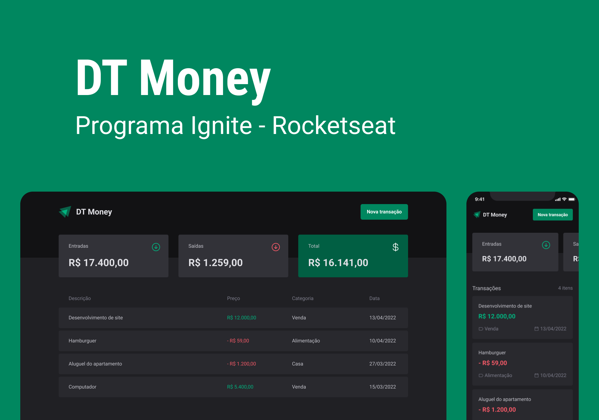

<h1 align="center">
    💵 DT Money (Layout mobile em breve)
</h1> 

<p align="center">
  
</p>

## 📌 Sobre o Projeto

O **Dt Money** é um projeto que vai te auxiliar no seu controle financeiro, onde é possível cadastrar saídas e entradas do seu dinheiro, podendo fazer pesquisar por nome ou categoria.

## 🚀 Tecnologias Utilizadas

O projeto foi desenvolvido com as seguintes tecnologias:

- [React](https://react.dev/)
- [Vite](https://vite.dev/)
- [TypeScript](https://www.typescriptlang.org/)
- Também foram utilizadas algumas bibliotecas para compor e otimizar o projeto, basta olhar o package.json

## 🔧 Requisitos

Antes de iniciar o projeto, certifique-se de ter instalado:

- [Node.js](https://nodejs.org/)

---

## 📦 Como Executar o Projeto (Dev)

### 1️⃣ Clonando o Repositório
```bash
$ git clone git@github.com:c4mpos-dev/dt-money.git
$ cd dt-money
```

### 2️⃣ Instalando Dependências
```bash
$ npm install
```

### 3️⃣ Executando a aplicação
```bash
$ npx run dev
```

### JSON-SERVER
```txt
Como essa aplicação é feita para treino, é necessário o uso do json-server, basta baixar e configurar a biblioteca, todos suas funcionaçidades estão em seu respositório. É necessário alterar a porta local no ./src/lib/axios.ts, o padrão é 3000.
```

---

## 🎨 Layout

O design do projeto está disponível no Figma:

- 🔗 [DT Money - Figma](https://www.figma.com/design/6XB8p5CDY4HzdhD0Fq8Fy0/DT-Money-(Community)?m=auto&t=9o60G88BHaeZub1O-6)